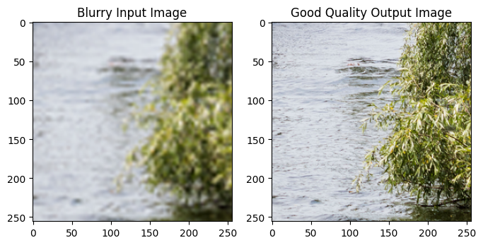
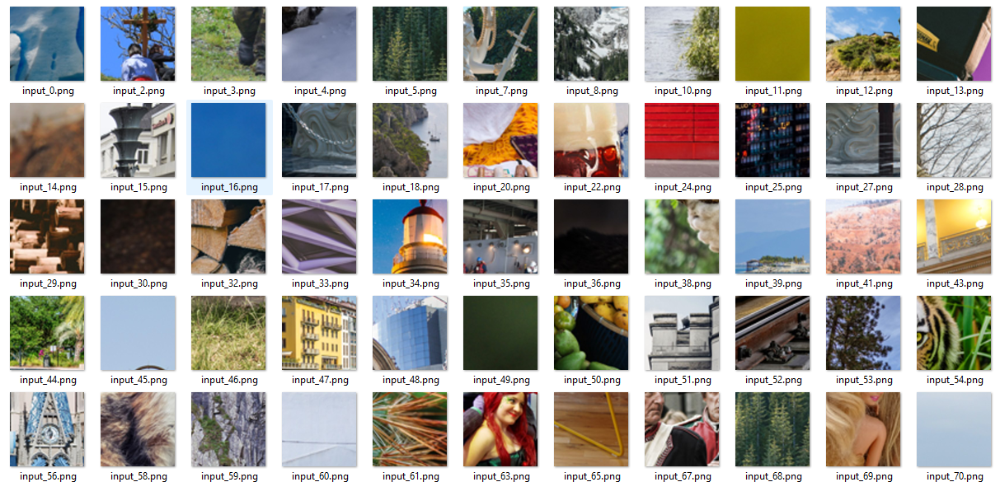
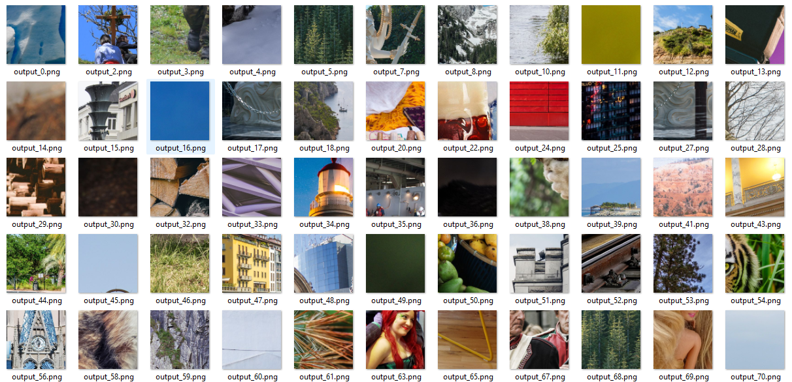

# BME 2025 Deep Learning Project
## Enhancing Image Super-Resolution with Generative Adversarial Networks (GANs)

### Members
Team VEO
- Vince Szigetvari OWC5ZP
- Eduardo Meza Medina IKUL3K
- Onur Aktan H55CGX

### Presentation of dataset

We are using the [DIV2K dataset](https://www.kaggle.com/datasets/francescopignatelli/div2k-dataset-antialias?resource=download-directory) for image super-resolution tasks. The dataset consists of high-quality images and their corresponding low-resolution versions, which are used for training and evaluating super-resolution models. Since the dataset at the original source was not available to download, we downloaded it from Kaggle.

The dataset has the following structure:
```
Dataset/
    ├── train/
    ├── train_labels/
    ├── validation/
    ├── validation_labels/
    ├── test/
    └── test_labels/
```

There are 19570 train image-pairs, 4193 validation image-pairs and 4195 test image-pairs in total. The size of the images is 256x256, both the low-resolution and high-resolution versions. Exploration of the dataset can be found in the `data_exploration.ipynb` notebook.



##### Example inputs:


##### Example outputs:
