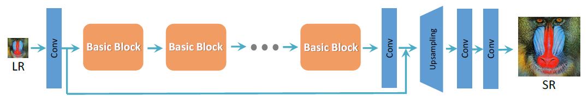
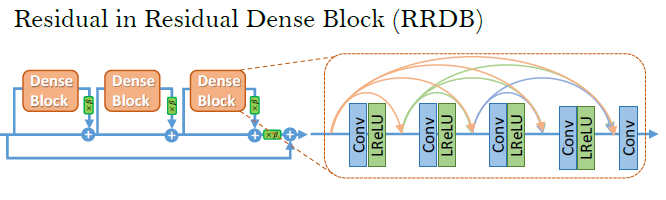

# BME 2025 Deep Learning Project
## Enhancing Image Super-Resolution with Generative Adversarial Networks (GANs)

### Members
Team VEO
- Vince Szigetvari OWC5ZP
- Eduardo Meza Medina IKUL3K
- Onur Aktan H55CGX

---
# 1. Introduction

TODO:

kkklllmmmmjkjhlk

o	Overview of the chosen topic

o	References to relevant scientific papers

---
# 2. Methods

## 2.1 SRGAN

TODO: describing GAN and superresolution concepts, and SRGAN architecture from the paper

### Discriminator Network

TODO: describing Discriminator architecture from srgan paper

### Generator Network

TODO: describing Generator architecture from srgan paper (8 RB instead of 16 in paper to make training faster)

### Loss Functions

TODO: describing loss functions from srgan paper

## 2.2 ESRGAN

### Modified Generator Network

TODO: describing ESRGAN generator architecture from the paper (what changed compared to SRGAN)

### Modified Loss Functions

TODO: describing loss functions from esrgan paper (what changed compared to SRGAN, (VGG loss before relu, Discriminator loss changes))

---
# 3. Training

TODO: describing training, times, hardware (L4 GPU on colab), tracking loss on wandb, changing hyperparameters (mainly the weight for the adversarial loss)

---
# 4. Evaluation

o	Results on the test data (metrics in table (PSNR and VGG loss))

o	Visualizations (plots, metrics, comparisons, etc.)

o	Sometimes subjective evaluation is also useful (e.g., user studies), based on our experience, ESRGAN had worse metrics but looked better visually

---
# 5. Conclusions
