# BME 2025 Deep Learning Project
## Enhancing Image Super-Resolution with Generative Adversarial Networks (GANs)

### Members
Team VEO
- Vince Szigetvari OWC5ZP
- Eduardo Meza Medina IKUL3K
- Onur Aktan H55CGX

---
# 1. Introduction
Image Super-Resolution (ISR) is a core challenge in computer vision that focuses on reconstructing a high-resolution (HR) image from a corresponding low-resolution (LR) input.  
The objective is to improve image clarity and recover intricate details typically lost due to downsampling, compression, or limitations of imaging sensors.

ISR plays a critical role in applications such as medical imaging, satellite photography, video surveillance, and digital media restoration, where visual quality and detail preservation are essential.

Traditional super-resolution techniques—like nearest-neighbor, bilinear, and bicubic interpolation—estimate missing pixels using predefined mathematical formulas.  
While computationally efficient, these methods often result in blurry or overly smooth images because they fail to reconstruct high-frequency information such as sharp edges and textures (Keys, 1981).

With the rise of deep learning, Convolutional Neural Networks (CNNs) have shown great potential in learning the complex transformations needed to map LR images to their HR versions (Dong et al., 2016).  
However, CNN models trained using only pixel-wise losses (e.g., Mean Squared Error) often prioritize numerical similarity over perceptual quality, leading to visually flat or unrealistic outputs.

To address this, Generative Adversarial Networks (GANs) (Goodfellow et al., 2014) introduced a novel adversarial training approach that enables the generation of more realistic, visually appealing images.  
A GAN consists of two networks—a generator and a discriminator—that engage in a minimax game:  
the generator attempts to produce realistic images, while the discriminator tries to distinguish between real and generated ones.  
This competition drives the generator to align its outputs more closely with human perception.

Building on this framework, Super-Resolution GAN (SRGAN) (Ledig et al., 2017) was the first to apply GANs to the super-resolution task.  
SRGAN combined adversarial loss with a VGG-based perceptual loss (Simonyan & Zisserman, 2015), leading to significantly sharper and more textured results than traditional CNN models.  
However, SRGAN still faced issues such as visual artifacts and unstable training.

To overcome these limitations, Enhanced Super-Resolution GAN (ESRGAN) (Wang et al., 2018) introduced several architectural and loss-function refinements.  
These included replacing SRGAN’s residual blocks with Residual-in-Residual Dense Blocks (RRDBs) for improved feature reuse and gradient flow,  
removing batch normalization to avoid color shifts and artifacts (Ioffe & Szegedy, 2015),  
and using a relativistic adversarial loss (Jolicoeur-Martineau, 2019) to boost perceptual realism while improving training stability.  
ESRGAN also revised the perceptual loss by computing it from pre-activation VGG feature maps, enabling reconstructions that appear more natural and visually rich.

This project focuses on the implementation and analysis of GAN-based image super-resolution models, particularly SRGAN and ESRGAN.  
These models will be trained using standard datasets such as DIV2K and CelebA, and evaluated both quantitatively (using PSNR and SSIM) and qualitatively (via Mean Opinion Score).  
By comparing these deep learning methods with traditional interpolation techniques, the project aims to highlight the benefits of adversarial and perceptual learning in generating high-resolution images that align closely with human visual expectations.

TODO:

o	References to relevant scientific papers

---
# 2. Methods
Image Super-Resolution (ISR) is the task of reconstructing a high-resolution image from its corresponding low-resolution input. Classic interpolation methods, including both bicubic and bilinear interpolations, perform the estimation based on deterministic mathematical formulations; these sometimes result in overly smooth and blurry outcomes due to their inability to recover high-frequency texture details (Keys, 1981). Deep learning-based methods overcome such limitations by learning non-linear mappings between LR and HR spaces (Dong et al., 2016).

Generative Adversarial Networks, proposed by Goodfellow et al. (2014), are composed of two neural networks competing with each other: one is the generator, and the other is the discriminator. The generator generates synthetic images that try to mimic real HR images, while the discriminator assesses whether its input is real or generated. This adversarial training process encourages the generator to synthesize more realistic and perceptually plausible images.
## 2.1 SRGAN
The Super-Resolution Generative Adversarial Network was the first GAN-based approach, proposed by Ledig et al. (2017), that achieved photo-realistic single-image super-resolution. SRGAN combines the adversarial loss with a perceptual loss computed using feature maps of a VGG network (Simonyan & Zisserman, 2015), which is able to produce sharper textures than a pixel-wise loss function like Mean Squared Error.
TODO: describing GAN and superresolution concepts, and SRGAN architecture from the paper
## 2.2 SRGAN Architecture
The SRGAN includes a generator and a discriminator network. The generator generates HR outputs from the LR images, and the discriminator is used to differentiate between real HR images and those that the generator produces. The adversarial loss, content loss, and perceptual loss altogether contribute to the training objective that guides the generator in generating visually realistic textures, together with structurally accurate reconstructions.

### Discriminator Network
In SRGAN, the discriminator network is used as a binary classifier to distinguish between the real and generated high-resolution images. Its architecture is based on principles established in Deep Convolutional GANs (DCGAN) by Radford et al. (2016), employing a deep convolutional design with no pooling layers.
- Input & Output: The discriminator takes an HR image patch of size 96×96 pixels and outputs a scalar probability that the input image is real or generated by the generator.
-  Feature Extraction: It uses several convolutional layers, each with an increasing amount of feature maps (64 → 128 → 256 → 512). Instead of pooling, the network applies strided convolutions at each layer, so downsampling is learned rather than fixed.
- Activation and Normalization: Each convolutional layer is followed by a LeakyReLU activation (α = 0.2) to avoid neuron saturation and improve the flow of gradients. Batch normalization is used to stabilize training and improve convergence (Ioffe & Szegedy, 2015).
- Fully Connected Layers: The final convolutional feature maps are flattened and go through dense layers, which finally leads to a sigmoid output neuron representing the probability of the input being real.
  
The objective function of the discriminator follows the standard binary cross-entropy loss used in GANs:

$$
\mathcal{L}_{D} = -\mathbb{E}[\log D(I^{HR})] - \mathbb{E}[\log(1 - D(G(I^{LR})))]
$$

Here, $D(\cdot)$ denotes the discriminator, $I^{HR}$ is a real high-resolution image, and $G(I^{LR})$ is the generated output of the generator.  
The discriminator aims to **maximize** this objective by correctly classifying real and generated samples,  
while the generator attempts to **minimize** it to successfully fool the discriminator.

TODO: describing Discriminator architecture from srgan paper

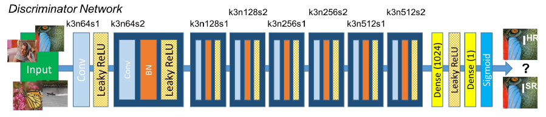

### Generator Network
The SRGAN generator network takes an LR image and outputs its HR version. Its objective is to reconstruct fine image details and realistic textures that resemble the ground truth HR image while maintaining global consistency and structural fidelity. The idea is from the work of Ledig et al. (2017).

The network structure of the SRGAN generator uses a deep residual network (ResNet), which has been shown to be effective in promoting stabilization for very deep networks, while accelerating the convergence. Instead of the direct learning of the mapping from LR to HR pixel space, the generator will learn the residual representation; this means the difference between the upscaled LR input—usually via bicubic interpolation—and the target HR image. This residual learning will help the network focus on reconstructing high-frequency details rather than redundant low-level structures.
The generator consists of a convolutional layer that extracts low-level features from the interpolated LR image. It is followed by a Parametric ReLU (PReLU) activation to introduce non-linearity without issues like vanishing gradients.
- Residual Blocks: The core of the generator consists of several residual blocks:
- Two convolutional layers with small $3\times3$ kernels: Batch normalization layers for regularization and stable training (Ioffe & Szegedy, 2015), and
- A PReLU activation between them: A residual connection—a skip connection—ensures that each block sees the input and can add it directly to the block's output. These residual connections help with gradient flow and thus enable the training of substantially deeper models.
- Feature Aggregation Layer: After the residual blocks, a convolutional layer is added on top to fuse the features coming from all residual paths. A skip connection from the initial feature map (before the residual stack) is added to this output, preserving the low-frequency information.
- Upsampling Layers: To increase spatial resolution, SRGAN uses two sub-pixel convolutional layers (also called pixel shuffle layers) that successively double the image resolution. Each upsampling layer is followed by a PReLU activation. These layers progressively reconstruct the HR image, learning the upscaling process in an end-to-end manner, rather than depending on predefined interpolation.

TODO: describing Generator architecture from srgan paper (8 RB instead of 16 in paper to make training faster)

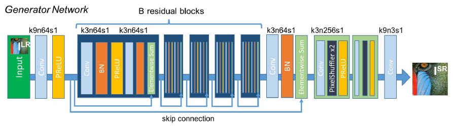

### Loss Functions
- Content (Perceptual) Loss

Instead of using a simple pixel-wise MSE loss, SRGAN incorporates a **VGG-based perceptual loss**.  
This measures differences between feature representations extracted from a pre-trained VGG-19 network  
(Simonyan & Zisserman, 2015), encouraging the generated images to match the high-level perceptual features  
of the ground-truth HR images rather than just pixel values.

$$
\mathcal{L}_{\text{content}} = \frac{1}{W H} \sum_{x,y} 
\left( \phi_{i,j}(I^{HR})_{x,y} - \phi_{i,j}(G(I^{LR}))_{x,y} \right)^2
$$

Here, $\phi_{i,j}$ represents the feature maps extracted from the $j$-th convolution layer  
before the $i$-th pooling layer of the VGG-19 network.

- Adversarial Loss

The adversarial loss encourages the generator to produce images that the discriminator classifies as real:

$$
\mathcal{L}_{\text{adv}} = -\mathbb{E}[\log D(G(I^{LR}))]
$$

- Total Generator Loss

The total generator loss is a weighted combination of perceptual and adversarial losses:

$$
\mathcal{L}_{G} = \mathcal{L}_{\text{content}} + 10^{-3} \times \mathcal{L}_{\text{adv}}
$$

This weighting factor balances **perceptual fidelity** with **texture realism**,  
allowing the generator to produce sharper, more natural-looking images.

TODO: describing loss functions from srgan paper

## 2.2 ESRGAN

### Modified Generator Network

The **Enhanced Super-Resolution Generative Adversarial Network (ESRGAN)**, proposed by **Wang et al. (2018)**, builds upon SRGAN to further enhance perceptual quality and stabilize training.  
The main architectural innovation is the use of **Residual-in-Residual Dense Blocks (RRDBs)**, which combine dense connections and residual learning to improve feature representation and gradient flow.

---

#### Key Architectural Changes Compared to SRGAN

- **Residual-in-Residual Dense Block (RRDB):**  
  Each RRDB merges the ideas of multiple densely connected convolutional layers within a residual framework.  
  This design allows for reusing features across layers, helping the network reconstruct textures and fine details more effectively.  
  Batch normalization is removed in RRDBs to reduce computation and avoid visual artifacts.

- **Batch Normalization Removal:**  
  Unlike SRGAN, ESRGAN omits all batch normalization layers.  
  This prevents over-smoothing and color distortion caused by normalization statistics, resulting in sharper and more stable outputs (**Ioffe & Szegedy, 2015**).

- **Residual Scaling and Smaller Initialization:**  
  To stabilize training of deeper networks, ESRGAN applies a residual scaling factor (typically 0.2).  
  Smaller weight initialization values also help control gradient magnitude, reducing the risk of divergence during adversarial training.

- **Deeper Generator Network:**  
  ESRGAN increases the number of residual blocks compared to SRGAN, which uses 16 basic residual blocks.  
  This deeper design helps the network learn more complex features and finer textures, ultimately improving perceptual quality.

**Generator Pipeline:**  
$\text{Input Image} \rightarrow \text{Feature Extraction} \rightarrow N \times \text{RRDB} \rightarrow \text{Upsampling Layers} \rightarrow \text{Output Image}$

---

### Modified Loss Functions

ESRGAN also refines the loss functions from SRGAN to achieve more realistic and visually pleasing results.

- **Perceptual Loss Based on Features Before Activation:**  
  Unlike SRGAN, which computes perceptual loss from activated VGG-19 feature maps, ESRGAN uses **pre-activation features (before ReLU)**.  
  These features contain richer information about texture, contrast, and color, helping to produce images that are perceptually sharper and more natural (**Simonyan & Zisserman, 2015**).

- **Relativistic Adversarial Loss:**  
  ESRGAN introduces the **Relativistic average Discriminator (RaD)**, which doesn’t just decide if an image is real or fake.  
  Instead, it compares how much more realistic a real image is than a generated one (**Jolicoeur-Martineau, 2019**).  
  This relativistic approach improves training stability and enhances the realism of fine details.

- **Total ESRGAN Generator Loss:**  
  The final generator loss in ESRGAN is a weighted combination of:

  - Perceptual loss ($\mathcal{L}_{\text{percep}}$)  
  - Relativistic adversarial loss ($\mathcal{L}_{G}^{Ra}$)  
  - Pixel-level $L_{1}$ loss  

  $$
  \mathcal{L}_{G}^{\text{ESRGAN}} = \mathcal{L}_{\text{percep}} + \lambda_{\text{adv}} \cdot \mathcal{L}_{G}^{\text{Ra}} + \lambda_{1} \, \Vert G(I_{\text{LR}}) -I_{\text{HR}} \Vert_{1}
  $$

  Here, $\lambda_{\text{adv}}$ and $\lambda_{1}$ are weighting coefficients.  
  The use of $L_{1}$ loss (instead of MSE in SRGAN) helps achieve sharper edges and better contrast.

  
TODO: describing loss functions from esrgan paper (what changed compared to SRGAN, (VGG loss before relu, Discriminator loss changes))

---
# 3. Training

TODO: describing training, times, hardware (L4 GPU on colab), tracking loss on wandb, changing hyperparameters (mainly the weight for the adversarial loss)

---
# 4. Evaluation

o	Results on the test data (metrics in table (PSNR and VGG loss))

o	Visualizations (plots, metrics, comparisons, etc.)

o	Sometimes subjective evaluation is also useful (e.g., user studies), based on our experience, ESRGAN had worse metrics but looked better visually

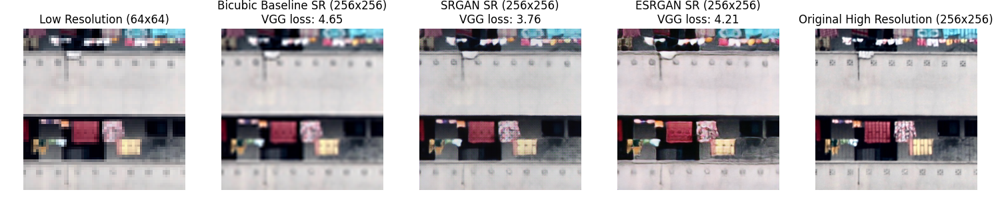

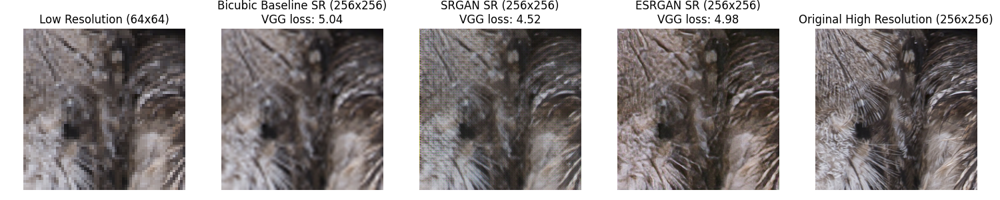

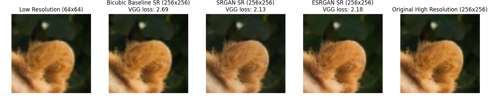

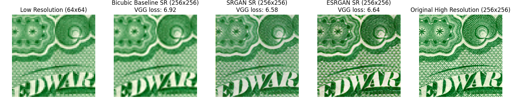

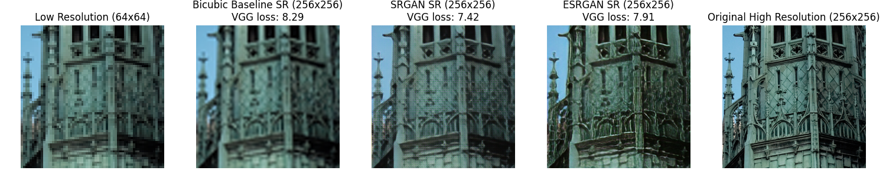

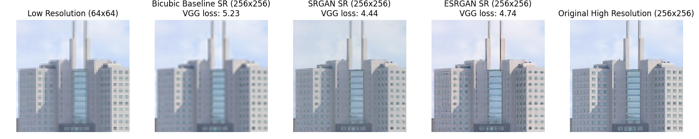

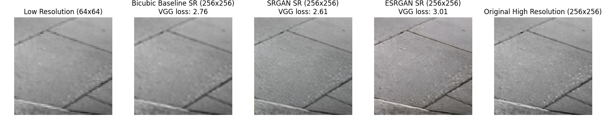

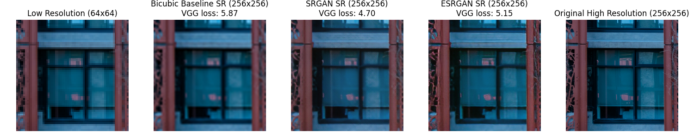

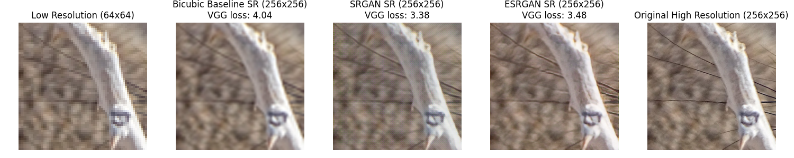

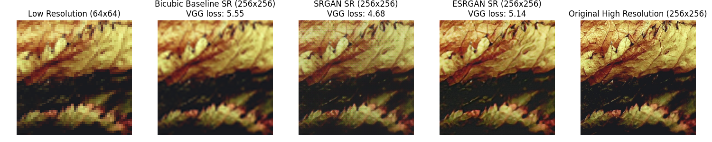

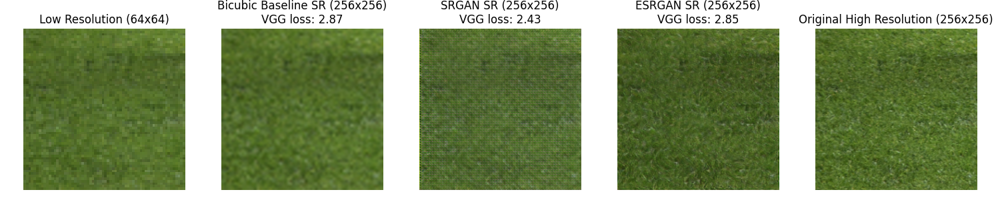

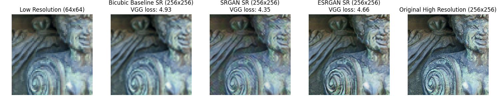

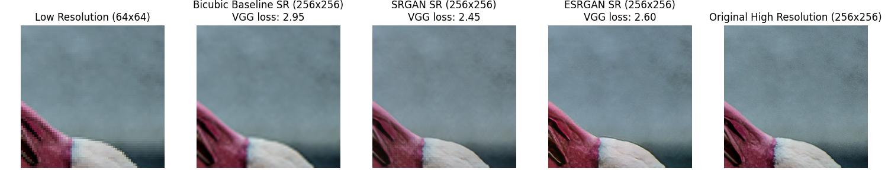

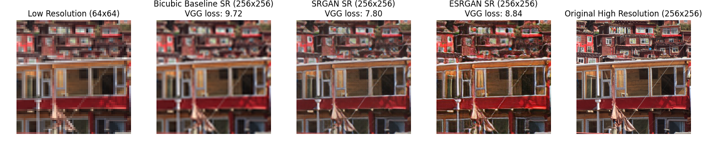

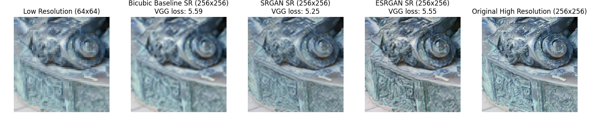

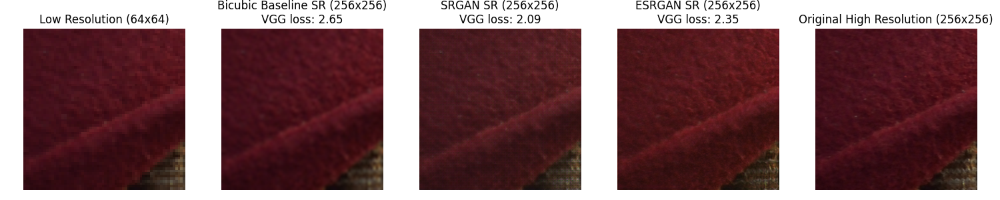

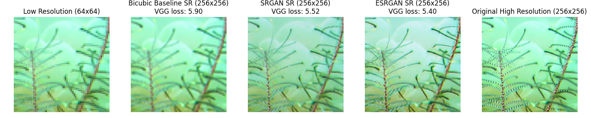

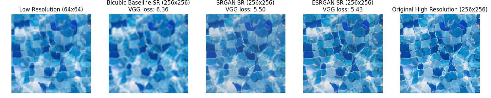

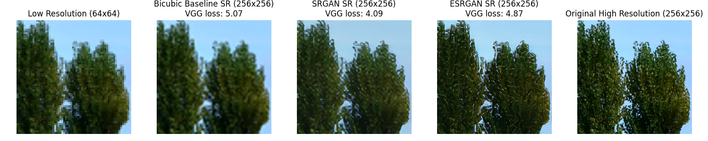

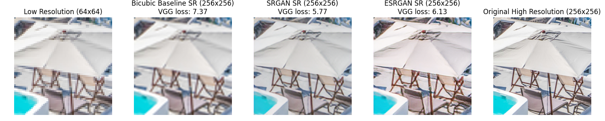

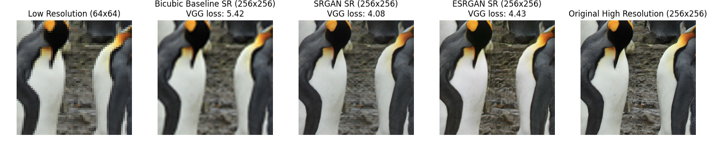

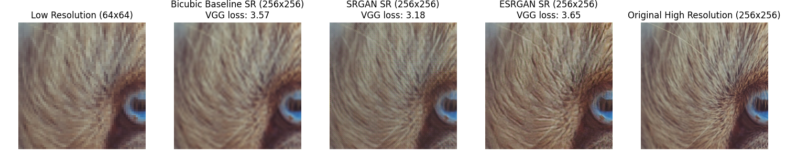

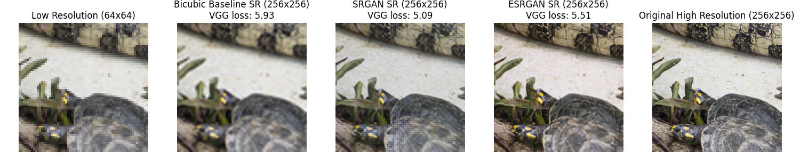

---
# 5. Conclusions

# References

- Dong, C., Loy, C. C., He, K., & Tang, X. (2016). Image super-resolution using deep convolutional networks. *IEEE Transactions on Pattern Analysis and Machine Intelligence*, 38(2), 295–307.

- Goodfellow, I., Pouget-Abadie, J., Mirza, M., Xu, B., Warde-Farley, D., Ozair, S., Courville, A., & Bengio, Y. (2014). Generative adversarial nets. *Advances in Neural Information Processing Systems*, 27, 2672–2680.

- Ioffe, S., & Szegedy, C. (2015). Batch normalization: Accelerating deep network training by reducing internal covariate shift. *Proceedings of the 32nd International Conference on Machine Learning (ICML)*, 448–456.

- Jolicoeur-Martineau, A. (2019). The relativistic discriminator: A key element missing from standard GANs. *International Conference on Learning Representations (ICLR).*

- Keys, R. (1981). Cubic convolution interpolation for digital image processing. *IEEE Transactions on Acoustics, Speech, and Signal Processing*, 29(6), 1153–1160.

- Ledig, C., Theis, L., Huszár, F., Caballero, J., Cunningham, A., Acosta, A., Aitken, A., Tejani, A., Totz, J., Wang, Z., & Shi, W. (2017). Photo-realistic single image super-resolution using a generative adversarial network. *Proceedings of the IEEE Conference on Computer Vision and Pattern Recognition (CVPR)*, 4681–4690.

- Radford, A., Metz, L., & Chintala, S. (2016). Unsupervised representation learning with deep convolutional generative adversarial networks. *International Conference on Learning Representations (ICLR).*

- Simonyan, K., & Zisserman, A. (2015). Very deep convolutional networks for large-scale image recognition. *International Conference on Learning Representations (ICLR).*

- Wang, X., Yu, K., Wu, S., Gu, J., Liu, Y., Dong, C., Qiao, Y., & Loy, C. C. (2018). ESRGAN: Enhanced Super-Resolution Generative Adversarial Networks. *Proceedings of the European Conference on Computer Vision (ECCV) Workshops.*
